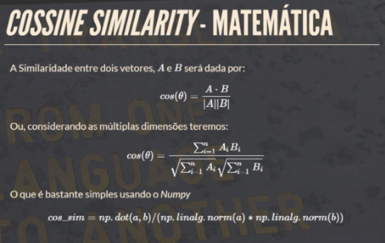

# Construção de Interpretadores - TF-IDF e Cosseno

# Realizado
Aluno: Vinícius Marques da Silva de Oliveira

# Enunciado
1. Sua tarefa será gerar a matriz termo-documento usando TF-IDF por meio da aplicação das
fórmulas  TF-IDF  na  matriz  termo-documento  criada  com  a  utilização  do  algoritmo  Bag of
Words. Sobre o Corpus que recuperamos anteriormente. O entregável desta tarefa é uma
matriz termo-documento onde a primeira linha são os termos e as linhas subsequentes são
os vetores calculados com o TF-IDF.

2. Sua tarefa será gerar uma matriz de distância, computando o cosseno do ângulo entre todos
os vetores que encontramos usando o tf-idf. Para isso use a seguinte fórmula para o cálculo
do  cosseno  use  a  fórmula  apresentada  em  Word2Vector  (frankalcantara.com)
(https://frankalcantara.com/Aulas/Nlp/out/Aula4.html#/0/4/2)  e  apresentada  na  figura  a
seguir:

O resultado deste trabalho será uma matriz que relaciona cada um dos vetores já calculados
com todos os outros vetores disponíveis na matriz termo-documento mostrando a distância
entre cada um destes vetores.